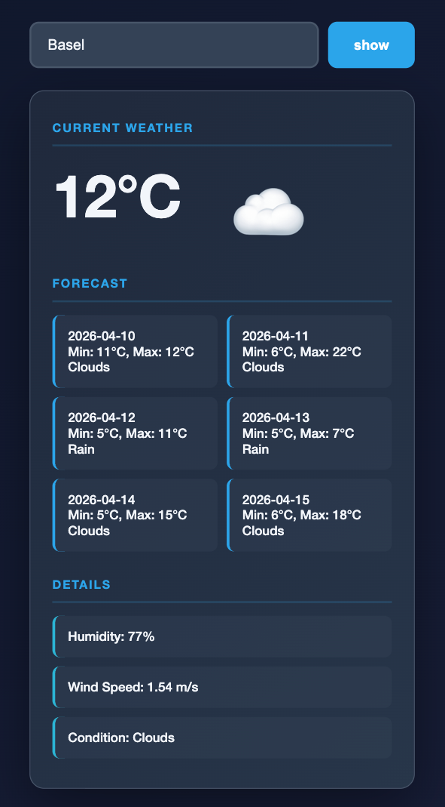

# SeggiWeather

A weather application for learning API integration between a wrapper-backend and frontend.
Containerized with Docker.


## What does the project do?

This project demonstrates how to integrate an external API (OpenWeatherMap) in the backend and consume it from the frontend.

**The Flow:**

1. Frontend sends city name to backend
2. Backend fetches data from OpenWeatherMap
3. Backend sends formatted data to frontend
4. Frontend displays the weather


## Technology

**Backend:**

- Java Spring Boot
- OkHttpClient
- Jackson ObjectMapper/ JsonNode

**Frontend:**

- HTML / CSS
- JavaScript (fetch API)

-> Containerized with Docker


## Architecture

```
Frontend (Port 3000)
└── index.html
└── script.js
└── fetch request → Backend

Backend (Port 8080)
└── WeatherController
└── WeatherService
└── OkHttpClient → OpenWeatherMap API
```


## Installation

### 1. Clone Repository

```bash
git clone https://github.com/DamiSeggi/SeggiWeather.git
cd SeggiWeather
```

### 2. Setup Environment Variables

Create `.env` file in root directory and insert:

```
WEATHER_API_KEY=YOUR_API_KEY_HERE
```

### 3. Start with Docker

```bash
docker-compose up --build
```

- Backend runs on `http://localhost:8080`
- Frontend runs on `http://localhost:3000`


## What I got better at / What I learned

- Building a Java Spring Boot wrapper backend
- Integrating external APIs (OpenWeatherMap)
- Handling HTTP requests with OkHttpClient
- Parsing JSON using Jackson (ObjectMapper & JsonNode)
- Structuring a backend service layer (Controller → Service)
- Using JavaScript fetch API for API calls
- Containerizing applications with Docker and Docker Compose


## Preview

